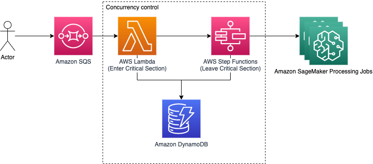

# Description

This projects allows an application to send SageMaker Processing requests to a queue and have concurrency control over how many jobs can run using a particular instance type concurrently as to avoid hitting account quota limits.

# Architecture



# Prerequisites
- AWS Account
- [SAM CLI](https://docs.aws.amazon.com/serverless-application-model/latest/developerguide/serverless-sam-cli-install.html) installed

# Deploying

```commandline
sam build 
sam deploy --stack-name queue --region us-east-1 --resolve-s3 --capabilities CAPABILITY_IAM
```

# Testing

This will send several job requests to SageMaker. You shouldn't see more than the specified instance limit trying to run concurrently.

```commandline
python sqs_send.py
```